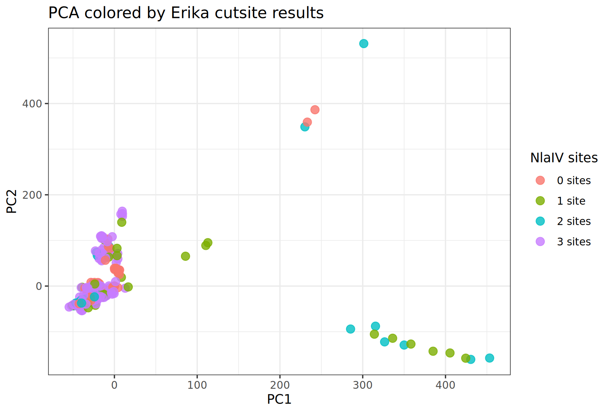

# Pocillopora Species Identification Workflow

## Objective

Determine whether samples contain the *Pocillopora damicornis* diagnostic marker region described by Johnston et al. and compare results with genome-wide SNP structure.

---

# 1. Created Diagnostic Reference FASTA

A reference FASTA was generated containing two marker sequences:

```fasta
>Pocillopora_damicornis
>Pocillopora_acuta
```

These sequences represent the diagnostic mitochondrial marker region used for species identification.

---

# 2. Mapped Reads to Diagnostic Marker

The original dDocent reference genome was removed from the working directory and replaced with the diagnostic marker FASTA.

dDocent was run in reference-mapping mode only.

Goal:

* Determine whether reads map to the *P. damicornis* marker sequence.
* Determine whether reads map to the *P. acuta* marker sequence.
* No SNP calling was performed.

---

# 3. Evaluated Mapping Results

Mapping statistics were examined using:

```bash
samtools idxstats sample.bam
```

Example output:

```text
Pocillopora_damicornis    829     0       0
Pocillopora_acuta         829     4       0
```

Interpretation:

* Reads mapped to the *P. acuta*-like sequence.
* Very little reads mapped to the *P. damicornis* reference sequence.

---

# 4. Generated Consensus Sequences

Consensus sequences were generated from mapped BAM files.

```bash
mkdir -p consensus_fastas

for bam in *.bam
do
    sample=${bam%.bam}

    samtools consensus \
        -f fasta \
        "$bam" > consensus_fastas/${sample}_consensus.fasta
done
```

* Examined restriction enzyme cut sites and diagnostic SNPs.

---

# 5. Counted Restriction Enzyme Cut Sites

Two restriction enzyme motifs described in Johnston et al. were evaluated.

## NlaIV

Recognition sequence:

```text
GGNNCC
```

## Tsp45I

Recognition sequence:

```text
GTSAC
```

where:

```text
S = G or C
```

Counts were generated using grep-based searches of consensus sequence + consensus sequences were uploaded to Geneious and examined on there (with Maddie) 

---

# 6. Cut Site Results

Contingency table:

```r
table(cuts$NlaIV_sites, cuts$Tsp45I_sites)

      0
  0  52
  1  42
  2  31
  3 153
```

### Tsp45I

All samples:

```text
Tsp45I = 0
```

No evidence for the *P. damicornis* diagnostic restriction site.

### NlaIV

Observed counts:

| NlaIV sites | Samples |
| ----------- | ------- |
| 0           | 52      |
| 1           | 42      |
| 2           | 31      |
| 3           | 153     |

---

# 7. Investigated Consensus Quality

Consensus sequences with different cut-site counts were inspected - I have Ns within the cutsites so I can't know how many have the cutsites with missinging nucleotides 

Example:

## 3-site sample

```text
Large portion of marker recovered
Relatively complete sequence
```

## 0-site sample

```text
Many missing bases (N)
Shorter consensus
```

Mapping statistics:

### Example 0-site sample

```bash
samtools flagstat 85_PA01-RG.bam
```

Output:

```text
1 mapped read
```

### Example 3-site sample

```bash
samtools flagstat 100_PA01-RG.bam
```

Output:

```text
45 mapped reads
```

---

# 8. Identified Diagnostic SNPs

The *P. damicornis* and *P. acuta* reference sequences were compared directly.

Diagnostic SNP positions:

| Position | Pdam | Pacuta |
| -------- | ---- | ------ |
| 480      | C    | A      |
| 578      | A    | G      |
| 580      | A    | G      |
| 582      | A    | G      |
| 596      | A    | C      |
| 672      | A    | G      |

These SNPs represent a more direct species-identification approach than restriction-site counting.

---

# 9. Genome-wide SNP Analysis

The filtered dDocent SNP dataset:

```text
Final.recode.vcf
```

was used for exploratory genetic analysis.

PCA was generated from genome-wide SNPs.



Samples were colored by NlaIV cut-site category. All samples with 3 cutsites grouped together  


Interpretation:

Restriction-site counts do not appear to correspond strongly with genome-wide genetic structure.

---

# Conclusions

Current evidence suggests:

1. Reads preferentially map to the *P. acuta*-like marker sequence.
2. No Tsp45I diagnostic sites characteristic of *P. damicornis* were detected.
3. NlaIV cut-site counts are strongly influenced by marker recovery and missing data.
4. Genome-wide PCA does not support clear separation based on NlaIV cut-site counts.
5. Direct interrogation of diagnostic SNP positions is likely more informative than restriction-site counting.

---

# Current Work

A species-specific mitogenome reference has been obtained.

Reads have been mapped to the mitogenome reference and mitochondrial consensus sequences will be generated for downstream phylogenetic and species-identification analyses.
